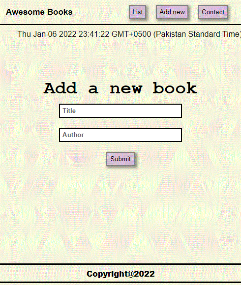
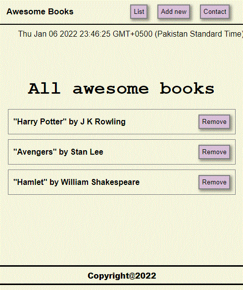
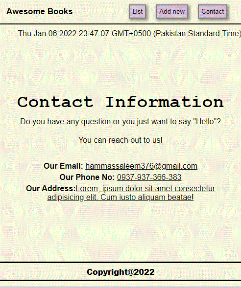

# AWESOME BOOKS
> This website GoodBooks provides users a convenient way to keep track of their books or reading lists. Users can add and remove books from the list of books they curate on the website.

## Built With

- HTML
- CSS
- JavaScript

## Clone and review it

Run the following commands to clone and run it.

### To clone the repository

  `git clone git@github.com:HAMMAS-SALEEM/GoodBooks-ES6.git`

### To enter Directory

`cd GoodBooks-ES6`

### To run 

`code .`

## Authors

👤 **Hammas Bin Saleem**

- GitHub: [@HAMMAS-SALEEM](https://github.com/HAMMAS-SALEEM)
- Twitter: [@HammasSaleem4](https://twitter.com/HammasSaleem4)
- LinkedIn: [HAMMAS SALEEM](https://www.linkedin.com/in/hammas-saleem-407)

👤 **Tarikwa Tesfa**

- GitHub: [Tarikwa Tesfa](https://github.com/tariktesfa)
- Twitter: [Tarikwa Tesfa](https://twitter.com/tarik_tesfa)
- LinkedIn: [Tarikwa Tesfa](https://www.linkedin.com/in/tarikwa-tesfa-232a64167/)

👤 **Benjamin Semah**

- GitHub: [Benjamin Semah](https://github.com/BenjaminSemah)
- Twitter: [Benjamin Semah](https://twitter.com/BenjaminSemah)
- LinkedIn: [Benjamin Semah](https://www.linkedin.com/in/benjaminsemah/)

## 🤝 Contributing
Contributions, issues, and feature requests are welcome!
Feel free to check the [issues page](../../issues/).

## Show your support
Give a ⭐️ if you like this project!

## Acknowledgments
- Hat tip to anyone whose code was used
- Inspiration
- etc

## 📝 License
This project is [MIT](./MIT.md) licensed.

